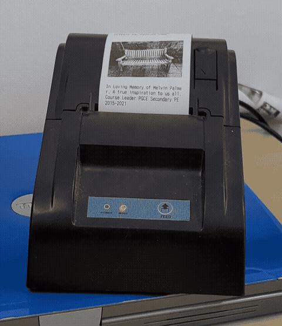

# Bench thermal printing

Printing benches from <https://openbenches.org/> with a ZJ-5870 ESC/POS thermal printer.



For more information on the bench endpoints, see the [transformer](https://github.com/alifeee/openbenches-train-sign/tree/main/transformer).


## Installation

Install required python modules

```bash
python -m venv env
./env/bin/pip install -r requirements.txt
```

To install Pillow, some prerequisites might be needed, these are:

```bash
sudo apt-get zlib1g-dev
sudo apt-get libjpeg62-turbo-dev
sudo apt-get install build-essential
sudo apt-get install python-dev
pip install pillow
```

### Install cron

The file `checkbench.sh` checks if the cached bench ID is the same as the current bench ID.

If it is not, it prints the bench using `printbench.sh`.

This script can be run as a cron, by running `crontab -e` and entering (change the directory to whatever it is installed to)

```cron
10 * * * * /home/alifeee/thermalprinter/benches/checkbench.sh >> /home/alifeee/thermalprinter/benches/cron.log 2>&1
```

## Usage

Print latest bench

```bash
./printbench.sh
```

Print 3rd latest bench

```bash
./printbench.sh 3
```

## ESC/POS

I use a 58mm [ZJ-5890TZJiang_5890T][ZJ-58] thermal printer (usually ZJ-58 in brief).

There are many drivers. You can also (in Linux) send commands "manually".

### Further reading

- <http://scruss.com/blog/2014/08/02/notes-on-mini-printers-and-linux/>
  - <https://github.com/klirichek/zj-58>
  - <https://github.com/python-escpos/python-escpos>
  - <https://gist.github.com/scruss/36c31a9b653779b2b7d1> (python print image)
  - <https://github.com/adafruit/Python-Thermal-Printer?tab=readme-ov-file>
  - <http://scruss.com/blog/2015/06/21/just-in-case-you-were-needing-a-thermal-printer-test-image/>
- <https://scruss.com/blog/2015/07/12/thermal-printer-driver-for-cups-linux-and-raspberry-pi-zj-58/>
- <https://mike42.me/blog/what-is-escpos-and-how-do-i-use-it>

### Manual commands

All characters (with printf) can be either plain, octal, or hex. See <https://www.asciitable.com/>

- plain → `b`
- octal → `\142`
- hex → `\x62`

So the "reset" sequence of `ESC @` can be represented as any of:

`\e@` `\033@` `\033\100` `\x1b@` `\x1b\x40` or probably more

Some commands are

```bash
# reset all formatting
printf "\e@" > /dev/usb/lp0
# send "some text"
printf "some text\n" > /dev/usb/lp0
# underline (number is 0 1 or 2)
printf "\033-2" > /dev/usb/lp0
# justified (0 1 or 2 for left/centre/right)
printf "\033a1" > /dev/usb/lp0
```

### Libraries

There are many libraries:

- Python: <https://github.com/python-escpos/python-escpos/>
- Node: <https://github.com/node-escpos/driver>
- PHP: <https://github.com/mike42/escpos-php>

There are also some "standalone" image printing scripts by @scruss:

- Using `ESC v` <https://gist.github.com/scruss/36c31a9b653779b2b7d1>
- Using `ESC *` <https://gist.github.com/scruss/95c61c9a1501ada2a6c5>

I have had problems with the `ESC v` one and printing an image with a resolution of `384x288`, while `384x289` has worked fine. This was the only difference I could see.

#### This project

This one uses the Python library. This has drawbacks, such as that you cannot access the printer over `/dev/usb/lp0` after using the Python library. I am not sure why. It seems that `p.close()` should give access of this back to you, but it doesn't seem to. Thus, I do all printing with the library, instead of a mix (which I would prefer).

[ZJ-58]: http://www.zjiang.com/en/init.php/product/index?id=28
